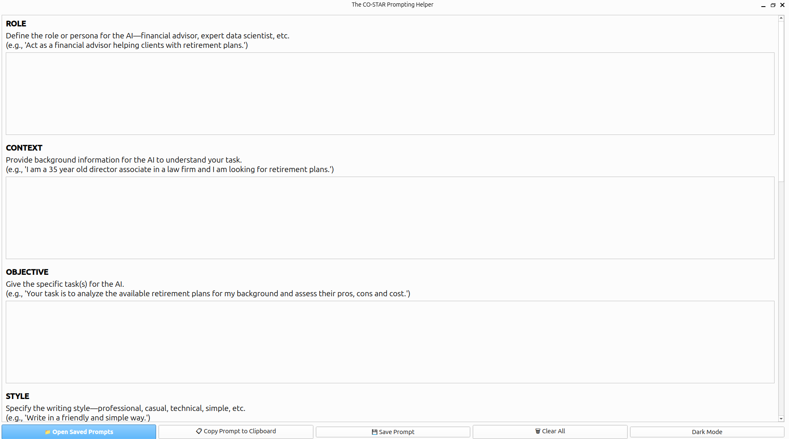
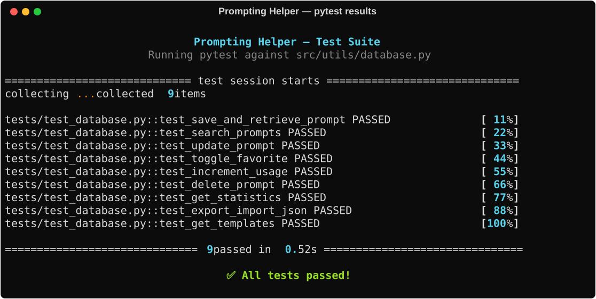

# 🌟 Prompting Helper

A desktop app that helps you craft better AI prompts using the **COSTAR framework** — and keeps a searchable library of all the prompts you create.

<p align="center">
  
</p>


## What is COSTAR?

COSTAR is a prompt engineering technique that structures your prompts across six dimensions for better, more consistent AI responses:

| Field | Description |
|---|---|
| **C**ontext | Background information for the task |
| **O**bjective | What you want the AI to do |
| **S**tyle | Writing style (e.g., formal, conversational) |
| **T**one | Emotional tone (e.g., friendly, authoritative) |
| **A**udience | Who the output is for |
| **R**esponse Format | How the output should be structured |

> This app also includes an optional **Role** and **Initial Analysis** field for even more precision.

## Features


- 📝 Guided form for filling in each COSTAR field
- 📋 One-click copy of the complete formatted prompt to clipboard
- 💾 Save prompts to a local SQLite database
- ⭐ Mark prompts as favorites
- 📁 Save reusable prompts as templates
- 🔍 Search your prompt library by title, content, or tags
- 🌙 Dark mode support
- 💻 Cross-platform: Windows, macOS, and Linux

## Requirements

- Python 3.10 or higher
- See `requirements.txt` for package dependencies

## Installation

### Option 1: Run from source (all platforms)

```bash
# 1. Clone the repository
git clone https://github.com/Efrazar/Prompting_helper_COSTAR.git
cd prompting-helper

# 2. Create and activate a virtual environment
python -m venv venv

# Windows
venv\Scripts\activate

# macOS / Linux
source venv/bin/activate

# 3. Install dependencies
pip install -r requirements.txt

# 4. Run the app
python src/main.py
```
### Option 2: Build a standalone executable with PyInstaller

Make sure you have installed requirements-dev.txt first:

```bash
# Windows
pyinstaller prompting_helper_windows.spec

# macOS
# Note: you need icon.icns — convert icon.png to icon.icns first
pyinstaller prompting_helper_macos.spec

# Linux
pyinstaller prompting_helper_linux.spec
```
The executable will be in the dist/ folder.
### Option 3: Windows installer (NSIS)

After building with PyInstaller on Windows, you can create an installer using NSIS:
```bash
makensis installer.nsi
```
This will generate PromptingHelper-Setup-1.0.0.exe.\
Where is my data stored?

Your prompts are saved locally in a SQLite database. The location depends on your OS:

    Windows: %LOCALAPPDATA%\PromptingHelper\prompts.db

    macOS: ~/Library/Application Support/PromptingHelper/prompts.db

    Linux: ~/.local/share/PromptingHelper/prompts.db

Project Structure

```text
prompting-helper/
├── src/
│   ├── main.py              # App entry point
│   ├── models/
│   │   ├── __init__.py
│   │   └── prompt.py        # SQLAlchemy data model
│   ├── ui/
│   │   └── main_window.py   # Main window + dialogs
│   └── utils/
│       └── database.py      # Database operations
├── docs/                    # Additional documentation
├── tests/                   # Unit tests
├── icon.ico                 # Windows icon
├── icon.png                 # Linux icon
├── installer.nsi            # Windows NSIS installer script
├── LICENSE.txt
├── prompting_helper_windows.spec
├── prompting_helper_macos.spec
├── prompting_helper_linux.spec
├── requirements.txt
├── requirements-dev.txt
└── version_info.txt         # Windows build version metadata
```
## Running the test and Generating Test Results SVG (for nice visuals)

The repo includes a script to regenerate the test results SVG shown above.
This is useful if you add new tests and want to update the visual output.

### Run the script

```bash
# From the project root with your virtual environment active
source venv/bin/activate        # macOS/Linux
venv\Scripts\activate           # Windows

python export_test_svg.py
```
This will:

    Run the full test suite automatically

    Capture the output with rich formatting

    Save a fresh `images/pytest_results.svg` file

### Themes

You can customize the color theme by editing the `theme= parameter` in
`export_test_svg.py`. Available built-in themes:

| Theme | Style |
|---|---|
| MONOKAI | Dark, classic Monokai colors (default) |
| DIMMED_MONOKAI | Softer darker version |
| NIGHT_OWLISH | Dark blue-toned night owl |
| SVG_EXPORT_THEME | Rich's default light theme |


### Expected output

<p align="center">
  
</p>

## Contributing

Contributions are welcome! Feel free to open issues or pull requests.
License

MIT License — see `LICENSE.txt` for details.
